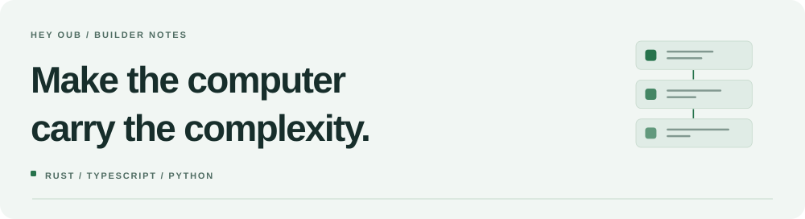

<picture>
  <source media="(prefers-color-scheme: dark)" srcset="./heyoub-dark.svg">
  <source media="(prefers-color-scheme: light)" srcset="./heyoub-light.svg">
  
</picture>

# Eassa Ayoub · Cognitive-First Systems

**Rust · TypeScript · Cloudflare**  
Founder, [Free Battery Factory](https://freebatteryfactory.com)

[Website](https://heyoub.dev) · [The factory](https://github.com/freebatteryfactory) · [LinkedIn](https://www.linkedin.com/in/eassageorge/) · [Get in touch](mailto:hello@heyoub.dev)

I came into software through mortgage, bookkeeping, small-business systems, sales, and field technology support. I've been on the other side of the software, trying to get the actual work done. That background shapes what I build.

I build Rust and TypeScript systems through Free Battery Factory. I'm interested in how state moves, how software adapts, and how much machinery we can stop making people carry in their heads.

> Most software makes users carry its complexity. I build software that feels like thinking.
>
> The question isn't just “is this complex?” It's “who carries the complexity?”
>
> **I vote computer.**

## Systems I've built

### [BatPAK](https://github.com/freebatteryfactory/batpak_DEPRECATED/tree/v0.10.0)
**Event history · Rust + TypeScript SDK**

An embedded, sync-first event store built around append-only history, typed events, verifiable receipts, and deterministic replay. The Rust core and TypeScript SDK share canonical encodings so the same events mean the same thing on either side.

[0.10.0 crate](https://crates.io/crates/batpak/0.10.0) · [TypeScript SDK](https://www.npmjs.com/package/@batpak/sdk) · [Documentation](https://docs.rs/batpak/0.10.0/batpak/)

### [LiteShip / CZAP](https://github.com/freebatteryfactory/LiteShip/tree/v0.10.0)
**Adaptive projection · TypeScript**

Continuous signals become named states, then project into CSS, graphics, accessibility, TypeScript, and runtime outputs. One set of definitions, rather than each surface keeping its own slightly different story about what the application is doing.

[0.10.0 source](https://github.com/freebatteryfactory/LiteShip/tree/v0.10.0) · [npm](https://www.npmjs.com/package/@czap/core/v/0.10.0) · [Documentation](https://freebatteryfactory.com/liteship/overview)

### [Macroonz](https://github.com/freebatteryfactory/Macroonz)
**Metaprogramming + adversarial testing · Rust**

Automate the repetitive code without handing over what it means. Macroonz combines a callable compiler, procedural macros, and a test harness. Recipes describe the structure; generated trials, faults, mutation, and replay challenge the resulting behavior. Your domain stays yours.

[Source](https://github.com/freebatteryfactory/Macroonz) · [Releases](https://github.com/freebatteryfactory/Macroonz/releases) · [crates.io](https://crates.io/crates/macroonz) · [Documentation](https://docs.rs/macroonz)

## What I'm working on now

I'm building business workflow software on **Cloudflare Workers**, using **Durable Objects, SQLite, R2, and Queues**. The goal is to make the machinery reusable without hard-coding every business into it.

I use coding agents extensively. The systems above are where that work meets my own design decisions, experiments, and iteration.

## Contributing elsewhere

I contribute to **[Code for Philly](https://github.com/CodeForPhilly)**. Merged work includes navigation and accessibility fixes in [codeforphilly-ng](https://github.com/CodeForPhilly/codeforphilly-ng/pulls?q=is%3Apr+author%3Aheyoub+is%3Amerged), and [developer setup and E2E verification](https://github.com/CodeForPhilly/benefit-decision-toolkit/pull/461) for Benefit Decision Toolkit.

## Working together

**Have a project?** I work with clients through Free Battery Factory. Bring the process, the problem, or the system you're trying to make better.

**Building a team?** I'm also open to joining one. Tell me what you're building and where you think I could contribute.

**Client work:** [hello@freebatteryfactory.com](mailto:hello@freebatteryfactory.com)  
**Roles and other conversations:** [hello@heyoub.dev](mailto:hello@heyoub.dev)
